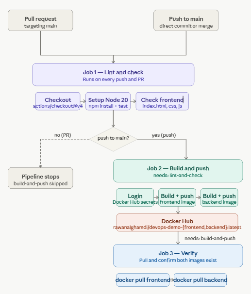

# DevOps Demo App

> A full-stack portfolio project demonstrating the complete DevOps lifecycle — local development, containerisation, Kubernetes orchestration, and automated CI/CD.


---

## Overview

A deliberately simple 3-tier web app. The point isn't the application — it's everything around it.

```
Browser → nginx (frontend) → Node.js API (backend) → PostgreSQL (database)
```

Click a button, get a message from the database. That's it. The interesting part is how it's built, containerised, deployed, and automated.

---

## Tech Stack

| Layer | Technology |
|---|---|
| Frontend | HTML, CSS, JavaScript, nginx |
| Backend | Node.js, Express |
| Database | PostgreSQL 15 |
| Containerisation | Docker |
| Local orchestration | Docker Compose |
| Container registry | Docker Hub |
| Orchestration | Kubernetes (minikube) |
| CI/CD | GitHub Actions |

---

## Architecture

The frontend never hardcodes the backend URL. Instead, nginx proxies all `/api/` requests to the backend internally — this is what makes the app run identically in both Docker Compose and Kubernetes without any configuration changes.

```
                    ┌─────────────────────────────┐
                    │        nginx (port 80)       │
                    │                             │
  Browser request   │  /          → static files  │
  ───────────────▶  │  /api/*     → backend:3000  │
                    │                             │
                    └──────────────┬──────────────┘
                                   │ proxy_pass
                                   ▼
                    ┌─────────────────────────────┐
                    │    Node.js / Express         │
                    │    (port 3000, internal)     │
                    └──────────────┬──────────────┘
                                   │
                                   ▼
                    ┌─────────────────────────────┐
                    │    PostgreSQL 15             │
                    │    (port 5432, internal)     │
                    └─────────────────────────────┘
```

In Docker Compose, `backend` resolves via Docker's internal DNS.
In Kubernetes, `backend` resolves via the Service name in the same namespace.

---

## Project Structure

```
devops-demo-app/
├── frontend/
│   ├── index.html
│   ├── style.css
│   ├── app.js
│   ├── nginx.conf        ← reverse proxy: /api/ → backend:3000
│   └── Dockerfile
├── backend/
│   ├── server.js
│   ├── package.json
│   └── Dockerfile
├── database/
│   └── init.sql          ← creates table + seeds data on first run
├── kubernetes/
│   ├── namespace.yaml
│   ├── postgres.yaml
│   ├── backend.yaml
│   └── frontend.yaml
├── .github/workflows/
│   └── ci-cd.yml         ← lint → build → push → verify
└── docker-compose.yml
```

---

## Prerequisites

| Tool | Purpose | Install |
|---|---|---|
| Docker Desktop | Build & run containers | [docker.com](https://www.docker.com/products/docker-desktop) |
| minikube | Local Kubernetes cluster | [minikube.sigs.k8s.io](https://minikube.sigs.k8s.io/docs/start) |
| kubectl | Kubernetes CLI | Included with Docker Desktop or [install separately](https://kubernetes.io/docs/tasks/tools/) |

---

## Option 1 — Docker Compose (quickest)

Runs the full stack locally with a single command.

```bash
git clone https://github.com/Rawalghamdi/devops-demo-app.git
cd devops-demo-app
```

**Mac / Linux:**
```bash
docker compose up --build
```

**Windows (Git Bash):**
```bash
COMPOSE_CONVERT_WINDOWS_PATHS=1 docker compose up --build
```

**Windows (PowerShell):**
```powershell
docker compose up --build
```

Open **http://localhost:8081** and click **Get Message**.

To stop:
```bash
docker compose down
```

---

## Option 2 — Kubernetes with minikube

### Step 1 — Start the cluster

```bash
minikube start
```

### Step 2 — Build and load images

> **Windows users:** Do NOT use `eval $(minikube docker-env)` in Git Bash — it causes a known file context bug on Windows where source files are not copied into the image. Use the workflow below instead.

```bash
# Build images using your local Docker Desktop
docker build -t rawanalghamdi/devops-demo-frontend:latest ./frontend
docker build -t rawanalghamdi/devops-demo-backend:latest ./backend

# Load them into minikube's local registry
minikube image load rawanalghamdi/devops-demo-frontend:latest
minikube image load rawanalghamdi/devops-demo-backend:latest
```

### Step 3 — Deploy

```bash
kubectl apply -f kubernetes/namespace.yaml
kubectl apply -f kubernetes/postgres.yaml
kubectl apply -f kubernetes/backend.yaml
kubectl apply -f kubernetes/frontend.yaml
```

### Step 4 — Wait for pods to be ready

```bash
kubectl get pods -n devops-demo --watch
```

All three pods (`frontend`, `backend`, `postgres`) should show `Running`. Press `Ctrl+C` to stop watching.

### Step 5 — Open the app

```bash
minikube service frontend -n devops-demo
```

Keep this terminal open — minikube needs it to maintain the tunnel. The app opens in your browser automatically.

> You do **not** need to expose the backend separately. nginx proxies `/api/` to the backend internally.

---


## Tear Down and Start Fresh (Kubernetes)

```bash

# Stop minikube
minikube stop

# Full reset (optional — deletes the cluster entirely)
minikube delete

```
---

## CI/CD Pipeline

Every push to `main` automatically runs:

```
Push to main
     │
     ▼
┌─────────────────┐
│  Job 1: Lint    │  Install deps · run tests · verify files exist
└────────┬────────┘
         │ (on success)
         ▼
┌─────────────────┐
│  Job 2: Build   │  Build frontend + backend images · push to Docker Hub
└────────┬────────┘
         │ (on success)
         ▼
┌─────────────────┐
│  Job 3: Verify  │  Pull images from Docker Hub · confirm availability
└─────────────────┘
```



### Required GitHub Secrets

Go to your repo → **Settings → Secrets and variables → Actions** and add:

| Secret | Value |
|---|---|
| `DOCKERHUB_USERNAME` | Your Docker Hub username |
| `DOCKERHUB_TOKEN` | Docker Hub access token (read/write scope) |

---

## Docker Hub Images

| Service | Image |
|---|---|
| Frontend | [`rawanalghamdi/devops-demo-frontend`](https://hub.docker.com/r/rawanalghamdi/devops-demo-frontend) |
| Backend | [`rawanalghamdi/devops-demo-backend`](https://hub.docker.com/r/rawanalghamdi/devops-demo-backend) |

---

## API Endpoints

| Method | Path | Description |
|---|---|---|
| `GET` | `/api/message` | Returns a message from PostgreSQL |
| `GET` | `/health` | Health check (used by Kubernetes liveness probe) |

---

## Common Issues

**`docker compose` fails with invalid volume specification on Windows**
Add `COMPOSE_CONVERT_WINDOWS_PATHS=1` before the command, or run in PowerShell instead of Git Bash.

**Kubernetes pod shows old code after rebuild**
Make sure you removed the old image from minikube before loading the new one (`minikube image rm` then `minikube image load`). Kubernetes caches aggressively.

**`minikube service` tunnel closes immediately**
Keep the terminal open. The tunnel only runs while that terminal session is active.

**`Cannot GET /` when accessing the backend URL directly**
That's expected — the backend has no root route, only `/api/message` and `/health`. Access the app through the frontend URL only.


kubectl scale deployment frontend -n devops-demo --replicas=0
minikube image rm docker.io/rawanalghamdi/devops-demo-frontend:latest
minikube image load rawanalghamdi/devops-demo-frontend:latest
kubectl scale deployment frontend -n devops-demo --replicas=1
kubectl rollout status deployment/frontend -n devops-demo